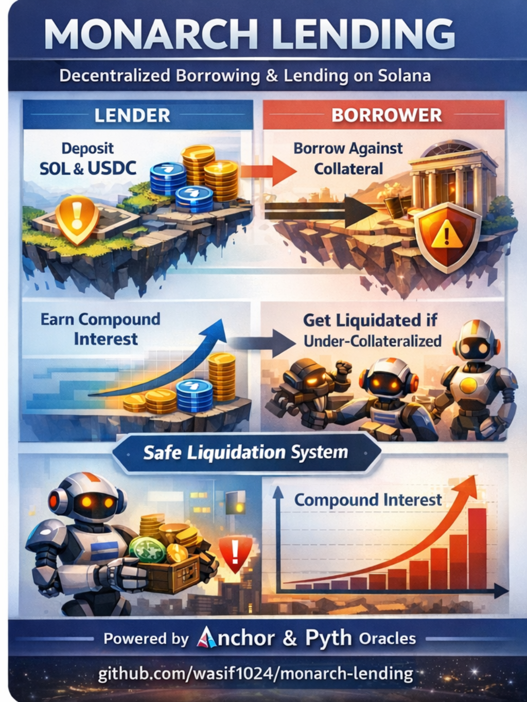

# WS Lending Protocol



> A decentralized lending protocol on Solana built with Anchor. Supports SOL and USDC deposits and borrows using share-based accounting with real-time oracle price feeds and automated liquidation mechanisms.

A production-ready decentralized lending protocol built on Solana using the Anchor framework. The protocol enables users to deposit SOL and USDC as collateral and borrow assets with real-time interest accrual. It implements a sophisticated share-based accounting system with automated liquidation capabilities, integrated with Pyth Network for secure price feeds.

## Features

- **Share-Based Accounting**: Advanced share-based system where deposits and borrows are converted to shares that automatically track interest accrual over time
- **Dual Asset Support**: Native support for SOL and USDC with separate liquidity pools and banks for each asset
- **Oracle Integration**: Integrated with Pyth Network for real-time, secure price feeds to calculate accurate collateral values and enable safe borrowing
- **Collateral-Based Borrowing**: Users can borrow assets based on their deposited collateral with configurable Loan-to-Value (LTV) ratios and liquidation thresholds
- **Automated Liquidations**: Built-in liquidation mechanism with configurable thresholds, bonuses, and close factors to protect protocol solvency
- **Compound Interest**: Exponential interest accrual on both deposits and borrows using continuous compounding
- **Program Derived Addresses (PDAs)**: Utilizes PDAs for deterministic account addresses and secure program-controlled accounts
- **Type-Safe Development**: Built with Anchor 0.30.1 for type-safe Solana program development and improved developer experience

## Architecture

### Core Components

#### Bank Account
The `Bank` account manages the state for each supported asset (SOL and USDC). Each bank maintains:

- `authority`: The program authority controlling the bank
- `mint_address`: The token mint address this bank manages
- `total_deposits`: Total amount of tokens deposited (increases with interest accrual)
- `total_deposits_share`: Total deposit shares issued (stays constant, enables interest tracking)
- `total_borrowed`: Total amount of tokens borrowed (increases with interest accrual)
- `total_borrowed_share`: Total borrow shares issued (stays constant, enables interest tracking)
- `liquidation_threshold`: Loan-to-value ratio at which liquidation can be triggered
- `liquidation_bonus`: Percentage bonus paid to liquidators as an incentive
- `liquidation_close_factor`: Maximum percentage of collateral that can be liquidated in a single transaction
- `max_ltv`: Maximum loan-to-value ratio allowed for borrowing against collateral
- `interest_rate`: Interest rate used for exponential interest accrual on deposits and borrows
- `last_updated`: Timestamp of the last state update

#### User Account
The `User` account tracks individual user positions and balances:

- `owner`: The user's wallet address (owner of the account)
- `deposited_sol` / `deposited_sol_share`: SOL deposit amounts and corresponding shares
- `borrowed_sol` / `borrowed_sol_share`: SOL borrow amounts and corresponding shares
- `deposited_usdc` / `deposited_usdc_share`: USDC deposit amounts and corresponding shares
- `borrowed_usdc` / `borrowed_usdc_share`: USDC borrow amounts and corresponding shares
- `usdc_mint_address`: USDC mint address for the user
- `last_updated`: Timestamp of last deposit/withdraw update
- `last_update_borrow`: Timestamp of last borrow/repay update

### Instructions

#### `initialize_bank`
Initializes a new bank for a specific token mint (SOL or USDC). This instruction:
- Creates a PDA `Bank` account derived from the mint address
- Creates a PDA treasury token account for holding user deposits
- Sets initial parameters including liquidation thresholds, LTV ratios, and interest rates

#### `init_user`
Initializes a user account for tracking deposits and borrows. This instruction:
- Creates a PDA `User` account derived from the user's wallet address
- Sets up the user's USDC mint address for cross-asset operations

#### `deposit`
Allows users to deposit SOL or USDC into the protocol. This instruction:
- Transfers tokens from the user's token account to the bank's treasury account
- Calculates and assigns shares based on the current exchange rate
- Updates the user's deposit balances and shares
- Updates the bank's total deposits
- Uses share-based accounting where the first deposit sets the initial exchange rate (1:1)

#### `withdraw`
Allows users to withdraw their deposited SOL or USDC. This instruction:
- Accrues interest on deposits using exponential growth based on elapsed time and interest rate
- Calculates the current value per share after interest accrual
- Validates that the user has sufficient balance (including accrued interest)
- Calculates shares to withdraw based on the current exchange rate
- Transfers tokens from the bank's treasury account back to the user's token account using PDA signing
- Updates the user's deposit balances and shares (decreases)
- Updates the bank's total deposits and shares (decreases)
- Creates the user's token account if it doesn't exist (init_if_needed)

#### `borrow`
Allows users to borrow SOL or USDC against their collateral. This instruction:
- Retrieves real-time price feeds from Pyth Network oracle
- Calculates total collateral value using accrued interest on deposits and current market prices
- Validates that the borrow amount doesn't exceed the liquidation threshold (LTV limits)
- Calculates and assigns borrow shares based on the current exchange rate
- Transfers tokens from the bank's treasury account to the user's token account using PDA signing
- Updates the user's borrow balances and shares (increases)
- Updates the bank's total borrowed and borrowed shares (increases)
- Initializes the borrow pool if this is the first borrow (sets exchange rate to 1:1)
- Creates the user's token account if it doesn't exist (init_if_needed)

#### `repay`
Allows users to repay their borrowed SOL or USDC. This instruction:
- Accrues interest on the total borrowed amount using exponential growth based on elapsed time and interest rate
- Calculates the current value per share after interest accrual
- Validates that the repay amount doesn't exceed the user's total debt (including accrued interest)
- Transfers tokens from the user's token account back to the bank's treasury account
- Calculates shares to remove based on the current exchange rate
- Updates the user's borrow balances and shares (decreases)
- Updates the bank's total borrowed and borrowed shares (decreases)
- Uses share-based accounting to ensure accurate interest calculation

#### `liquidate`
Allows liquidators to liquidate undercollateralized positions. This instruction:
- Retrieves real-time price feeds from Pyth Network for both collateral and borrowed assets
- Calculates current collateral value (with accrued interest) and current debt value (with accrued interest)
- Computes health factor to verify the position is undercollateralized
- Validates that liquidation is necessary (health factor < 1.0)
- Calculates liquidation amount based on close factor
- Transfers borrowed tokens from liquidator to the bank (repaying part of the debt)
- Transfers collateral tokens from the bank to the liquidator (including liquidation bonus)
- Uses PDA signing for secure treasury account transfers
- Creates liquidator token accounts if they don't exist (init_if_needed)
- Protects protocol solvency by ensuring undercollateralized positions are liquidated

## Project Structure

```
ws_lending/
├── programs/
│   └── ws_lending/
│       └── src/
│           ├── lib.rs              # Main program entry point and instruction handlers
│           ├── errors.rs           # Custom error definitions (InsufficientBalance, OverBorrowedLimit, etc.)
│           ├── constants.rs        # Constants (Pyth feed IDs, max price age)
│           ├── states/
│           │   ├── mod.rs
│           │   └── states.rs       # Account state definitions (Bank, User)
│           └── instructions/
│               ├── mod.rs
│               ├── admin.rs        # Admin instructions (initialize_bank, init_user)
│               ├── deposit.rs      # Deposit instruction
│               ├── withdraw.rs     # Withdraw instruction
│               ├── borrow.rs       # Borrow instruction
│               ├── repay.rs        # Repay instruction
│               └── liquidate.rs    # Liquidation instruction
├── tests/
│   └── ws_lending.ts               # Test suite
├── Anchor.toml                     # Anchor configuration
├── Cargo.toml                      # Rust workspace configuration
└── package.json                    # Node.js dependencies
```

## Prerequisites

- [Rust](https://www.rust-lang.org/tools/install) (latest stable version)
- [Solana CLI](https://docs.solana.com/cli/install-solana-cli-tools) (v1.18 or higher)
- [Anchor](https://www.anchor-lang.com/docs/installation) (v0.30.1)
- [Yarn](https://yarnpkg.com/getting-started/install) (v3.1.1 or higher)
- Node.js (v16 or higher)

### Key Dependencies

- **Anchor Lang/SPL**: Core framework for Solana program development providing type safety and developer tooling
- **Pyth Solana Receiver SDK**: Oracle integration for real-time, secure price feeds from Pyth Network

## Installation

1. Clone the repository:
```bash
git clone <your-repo-url>
cd ws_lending
```

2. Install dependencies:
```bash
yarn install
```

3. Build the program:
```bash
anchor build
```

## Development

### Build the Program
```bash
anchor build
```

### Run Tests
```bash
anchor test
```

### Deploy to Localnet
```bash
# Start a local validator
solana-test-validator

# In another terminal, deploy
anchor deploy
```

### Deploy to Devnet
```bash
# Set cluster to devnet
solana config set --url devnet

# Deploy
anchor deploy
```

## Configuration

The program is configured via `Anchor.toml`:

- **Program ID**: `FDpT1vmBWwJvEf7RbDAy1STwUs4AUEXraB6wEnj5bVRd`
- **Cluster**: Configured for `localnet` (change to `devnet` or `mainnet` as needed)
- **Wallet**: Defaults to `~/.config/solana/id.json`

## How It Works

### Share-Based Accounting

The protocol uses a sophisticated share-based accounting system that enables efficient interest accrual without updating individual user accounts on every block:

1. **Exchange Rate Calculation**: `total_deposits / total_deposits_share` or `total_borrowed / total_borrowed_share`
2. **On Deposit/Borrow**: Users receive shares proportional to their deposit/borrow amount at the current exchange rate
3. **Interest Accrual**: `total_deposits` or `total_borrowed` increases exponentially with time while shares remain constant
4. **On Withdrawal/Repay**: Shares are converted back to tokens using the current exchange rate, which includes all accrued interest

This design allows interest to accrue continuously to depositors and borrowers without requiring constant on-chain updates to individual user accounts, reducing computational costs and improving efficiency.

### Interest Accrual

Interest accrues using continuous compounding with the formula:
```
new_value = original_value * e^(interest_rate * time_difference)
```

This ensures that interest compounds continuously, providing fair and accurate interest calculations for both depositors and borrowers.

### Example Flow

**Deposit Example:**
1. Initial state: `total_deposits = 1000`, `total_deposits_share = 1000` (exchange rate = 1.0)
2. User deposits 100 tokens: receives 100 shares. New state: `total_deposits = 1100`, `total_deposits_share = 1100`
3. Interest accrues over time: `total_deposits = 1200`, shares stay at 1100 (exchange rate = 1.09)
4. User withdraws: 100 shares convert to ~109 tokens (100 * 1200 / 1100), earning ~9% interest

**Borrow and Liquidation Example:**
1. User deposits $1000 worth of SOL as collateral
2. User borrows $700 worth of USDC (70% LTV)
3. SOL price drops, collateral value becomes $600
4. Health factor drops below 1.0 (under-collateralized)
5. Liquidator repays part of the debt and receives collateral plus bonus

## Security Considerations

This protocol includes multiple security mechanisms:

- **Oracle Price Feeds**: Uses Pyth Network for secure, real-time price data with staleness checks
- **Liquidation Thresholds**: Configurable LTV limits prevent over-borrowing
- **Share-Based Accounting**: Prevents rounding errors and ensures accurate interest calculations
- **PDA-Based Accounts**: Deterministic addresses provide security and predictability
- **Input Validation**: Comprehensive checks for balances, limits, and conditions

**Important Notes:**
- Always verify oracle price feed freshness before relying on prices
- Liquidation parameters should be carefully calibrated based on market volatility
- Interest rates should be set based on market conditions and risk assessments
- Regular security audits are recommended before production deployment

## License

ISC

## Contributing

Contributions are welcome! Please feel free to submit a Pull Request. For major changes, please open an issue first to discuss what you would like to change.

## Acknowledgments

Built as part of a Solana bootcamp, demonstrating best practices in Anchor framework development and DeFi protocol implementation on Solana.
